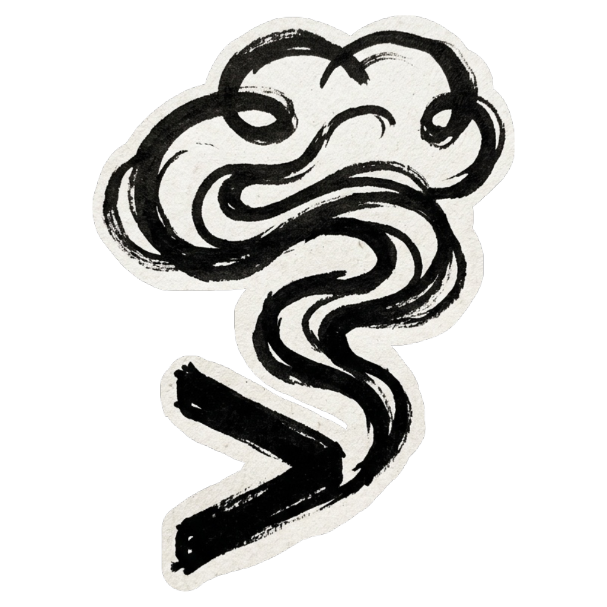

<p align="center">
  
</p>

<h1 align="center">SMOKE</h1>

<p align="center">
  <em>Write. Run. Know.</em>
</p>

<p align="center">
  
  
  
  
</p>

---

A PreToolUse hook for Claude Code that runs AI-generated JS/TS and Python code
in a sandbox **before** the agent's file write is allowed to complete.
The agent finds out about bugs the same second it introduces them.

## How it works

SMOKE sits between the agent's intent and the filesystem. Every time the agent writes or edits a `.js`, `.ts`, or `.py` file:

```
Write/Edit tool call
      │
      ▼
  ┌─────────────────────┐
  │ 1. tree-sitter      │  Syntax pre-check (instant)
  │    checks syntax    │
  └─────┬───────────────┘
        │ fail → block (exit 2)
        │ pass
        ▼
  ┌─────────────────────┐
  │ 2. Extract snippet  │  Only for large files (>200 lines)
  │    (optional)       │  Runs just the enclosing function
  └─────┬───────────────┘
        │
        ▼
  ┌─────────────────────┐
  │ 3. Run in sandbox   │  JS/TS: V8 (deno_core), no fs/net
  │                     │  Python: process-isolated + seccomp
  └─────┬───────────────┘
        │ fail → block (exit 2)
        │ pass
        ▼
  ┌─────────────────────┐
  │ 4. PostToolUse      │  Discovers & runs co-located tests
  │    auto-tests       │  *.test.*, *.spec.*, tests/test_*
  └─────┬───────────────┘
        │ fail → block
        │ pass
        ▼
     Write completes
```

Three integration paths, one sandbox core:

| Mode | Setup | Use case |
|------|-------|----------|
| **`hook`** | `.claude/settings.json` | PreToolUse — blocks bad code before it lands |
| **`post-hook`** | `.claude/settings.json` | PostToolUse — runs co-located tests after write |
| **`server`** | `.mcp.json` | MCP tool — `smoke_verify` from any MCP client |

## Install

```bash
cargo build --release
```

Then register it with Claude Code:

**PreToolUse** — catches bugs before they hit disk:

```json
{
  "hooks": {
    "PreToolUse": [{
      "matcher": "Write|Edit",
      "hooks": [{
        "type": "command",
        "command": "./target/release/smoke hook",
        "timeout": 10,
        "statusMessage": "SMOKE: verifying code..."
      }]
    }]
  }
}
```

**PostToolUse** — auto-discovers and runs co-located tests after every write:

```json
{
  "hooks": {
    "PostToolUse": [{
      "matcher": "Write|Edit",
      "hooks": [{
        "type": "command",
        "command": "./target/release/smoke post-hook",
        "timeout": 30
      }]
    }]
  }
}
```

**MCP server** — smoke-verify from any client:

```json
{
  "mcpServers": {
    "smoke": {
      "type": "stdio",
      "command": "./target/release/smoke",
      "args": ["server"]
    }
  }
}
```

Both hooks and the MCP server can live in the same project — they share the same sandbox implementation and config.

## Commands

| Command | What it does |
|---------|--------------|
| `smoke test --code '...' --lang js` | Run a snippet in the sandbox directly |
| `smoke hook` | PreToolUse handler (stdin JSON → stdout JSON) |
| `smoke post-hook` | PostToolUse handler (discovers & runs tests) |
| `smoke server` | MCP server over stdio |
| `smoke config init` | Generate a `.smoke.toml` with defaults |
| `smoke config show` | Print the effective config |

## Config

Four layers, each overriding the previous:

```
built-in defaults  ←  ~/.config/smoke/smoke.toml  ←  .smoke.toml  ←  --config <path>
```

Generate a file with `smoke config init`:

```toml
[limits]
timeout_ms = 5000
memory_mb = 128

[Languages]
javascript = true
typescript = true
python = true
```

Every option is optional — set just what you need.

## Security model

**JS/TS execution** is sandboxed by the V8 engine. Code has no filesystem
or network access by default. This is a property of the engine, not of our
configuration.

**Python execution** is process-isolated with resource limits (CPU time,
memory) and a partial seccomp filter (denies fork/exec and raw sockets).
This is **not** a full sandbox:

- Logic-based escapes (`__subclasses__()`, frame manipulation) stay within the Python VM and are not prevented by seccomp
- Do not run untrusted third-party Python through SMOKE expecting container-grade isolation — use E2B or Modal for that
- SMOKE's Python value is catching bugs in *agent-generated* code before they reach disk — code the agent wrote, not adversarial code

## Design

- **Fail-open**: SMOKE never breaks Claude Code's tool pipeline. Parse failures, unknown extensions, and disabled languages produce `exit 0` (allow). Only syntax/runtime errors produce `exit 2` (block).
- **Watchdog thread**: JS/TS infinite loops are killed by a watchdog OS thread polling at 10ms — the only reliable way to break synchronous V8 loops.
- **Two-phase kill**: Python timeouts get SIGTERM → 500ms → SIGKILL to the process group.
- **Snippet extraction**: For large files (>200 lines), only the enclosing function around the edit region runs — keeps verification fast.
- **~5ms JS startup**: V8 via deno_core starts cold in milliseconds.

## FAQ

**Does it work with any agent?**
It's built for Claude Code's hook system. The MCP server (`smoke server`) works with any MCP client — Claude Code, Copilot, Cursor, etc.

**What about Node.js dependencies?**
JS/TS sandbox has no filesystem or network access — `require` and `import` that reach for modules will fail. The sandbox tests the snippet in isolation.

**Can I turn it off per-language?**
Yes. Set `javascript = false`, `typescript = false`, or `python = false` in `.smoke.toml`.

**Will it block my agent on a test I haven't written yet?**
PostToolUse only runs tests that exist. No test file, no check.

**Why Rust?**
~5ms JS startup. Embedded V8. seccomp syscall filtering. Tree-sitter parsing at compile time. Zero-copy config merging. A scripting language would have been a meta problem to solve.

## License

[Apache 2.0](LICENSE).
